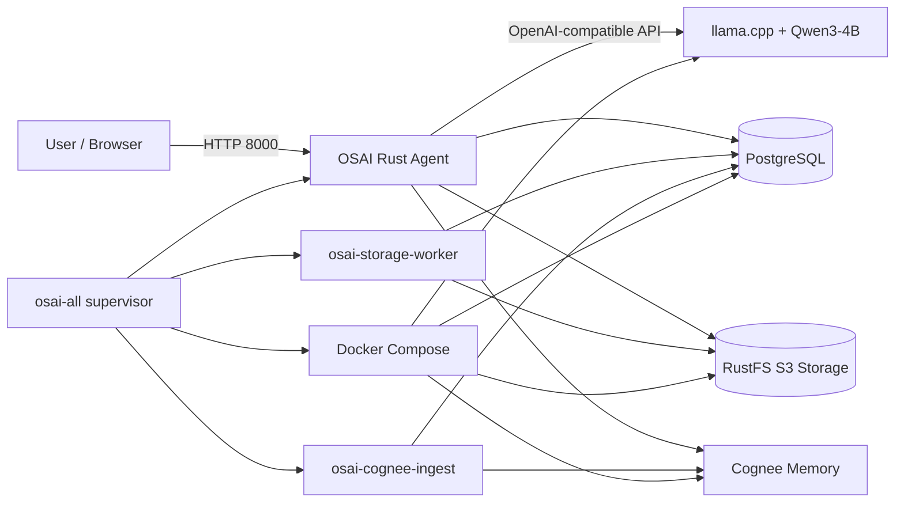
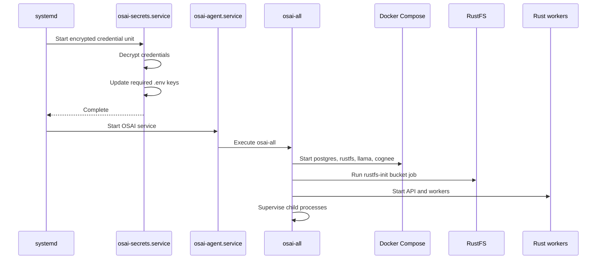

# OSAI Agent

> **One installation. Start talking to your Linux server.**

OSAI Agent is a Rust-based, open-source, on-premises-first hybrid AI operations assistant for Linux machines and servers.

It combines:

- a Rust API, dashboard, scanner, workers, and runtime supervisor
- local LLM inference through `llama.cpp`
- Qwen reasoning through the exact GGUF model `Qwen3-4B-Q4_K_M.gguf`
- PostgreSQL for structured metadata and runtime state
- RustFS for S3-compatible object storage
- Cognee for persistent memory and contextual retrieval
- Docker Compose for the supporting runtime
- systemd for secret injection, service supervision, restart behavior, and boot persistence
- OpenTofu for one-click Google Cloud deployment

OSAI can run locally after its model, binaries, and container images are available. Internet access is required for the initial clone, package installation, image pulls, and model download unless those artifacts are preloaded. Optional cloud integrations can still be used when internet access is available.

---

## One-click installation

OSAI supports two main installation paths:

1. Install directly on an existing Ubuntu or AlmaLinux machine.
2. Create a Google Cloud VM with OpenTofu and let the VM startup script install and start everything automatically.

### Supported operating-system baseline

Use one of the following:

- Ubuntu 24.04 or newer
- AlmaLinux 9 or 10

The current one-shot credential flow requires a systemd release that provides `systemd-creds` and `LoadCredentialEncrypted=`.

### Recommended machine sizes

| Profile | vCPU | Memory | Disk | Intended use |
|---|---:|---:|---:|---|
| Minimum lab | 2 | 8 GB | 30 GB | Development and single-user testing |
| Balanced | 4 | 16 GB | 50 GB | Recommended local or cloud development |
| Higher throughput | 8+ | 32+ GB | 80+ GB | Larger context, more parallel work, and heavier Cognee processing |

The current Google Cloud development configuration uses `e2-standard-2`: 2 vCPUs and 8 GB RAM. It can run the stack, but llama.cpp must be configured conservatively and the machine should not be treated as a high-concurrency deployment.

---

# Repository structure

```text
OS.rs/
├── README.md
│
├── get-osai-os-ready/
│   ├── lets-rust-now.sh
│   └── Layers/
│       ├── Cargo.toml
│       ├── Cargo.lock
│       ├── src/
│       └── target/
│
├── infra/
│   ├── README.md
│   ├── environments/
│   │   └── dev/
│   │       ├── main.tf
│   │       ├── outputs.tf
│   │       ├── providers.tf
│   │       ├── variables.tf
│   │       ├── versions.tf
│   │       ├── terraform.tfvars
│   │       └── scripts/
│   │           └── starters.sh
│   └── modules/
│       ├── compute/
│       ├── iam/
│       └── network/
│
└── osai-agent/
    ├── Cargo.toml
    ├── Cargo.lock
    ├── src/
    │   └── bin/
    │       └── osai-all.rs
    ├── docker-compose.storage.yml
    ├── docker/
    │   ├── cognee/
    │   └── llama/
    ├── storage/
    │   └── postgres-init/
    ├── models/
    │   └── Qwen3-4B-Q4_K_M.gguf
    ├── .env.storage.example
    ├── .env.cognee.example
    ├── .env.storage
    ├── .env.cognee
    └── target/
        └── release/
            ├── osai-all
            ├── osai-agent
            ├── osai-storage-worker
            └── osai-cognee-ingest
```

The tree above shows the important operational paths. Generated files such as `target/`, real `.env` files, OpenTofu state, and downloaded model files must remain excluded from Git.

---

# What each main folder does

## `get-osai-os-ready/`

This is the machine preparation and readiness layer.

It is responsible for preparing the host before the full OSAI runtime starts. Depending on the current implementation, its Bash and Rust components may:

- detect Ubuntu, Debian, AlmaLinux, Rocky Linux, CentOS, or RHEL-family systems
- install base packages
- install Docker Engine and the Docker Compose plugin
- create the dedicated `osai` user
- install Rust for the `osai` user
- clone or update the repository
- validate required directories and files
- build the readiness binary
- run machine checks and corrective setup

The main Rust readiness project is:

```text
get-osai-os-ready/Layers/
```

Manual execution:

```bash
sudo -iu osai
cd /opt/osai/OS.rs/get-osai-os-ready/Layers
source "$HOME/.cargo/env"

cargo check
cargo build --release
./target/release/get-osai-os-ready
```

The readiness binary is a one-shot process. It should complete and exit. It is not the continuously running OSAI agent.

## `infra/`

This folder contains the OpenTofu configuration for Google Cloud infrastructure.

Its responsibilities include:

- creating the VPC and subnet
- creating IAM bindings and service-account access
- creating the Compute Engine VM
- configuring the boot disk and network interface
- attaching the startup script
- exposing useful deployment outputs

The environment-specific entry point is:

```text
infra/environments/dev/
```

The VM startup script is:

```text
infra/environments/dev/scripts/starters.sh
```

Google Compute Engine runs this script automatically during VM startup after networking becomes available.

## `osai-agent/`

This is the main OSAI application and runtime.

It contains:

- the Rust dashboard and API
- the storage worker
- the Cognee ingestion worker
- the `osai-all` supervisor
- Docker Compose support services
- model files
- storage initialization
- runtime configuration

The main background supervisor is:

```text
osai-agent/target/release/osai-all
```

`osai-all` starts the Docker support stack, ensures the RustFS bucket exists, starts the Rust binaries, and supervises them. If a supervised child exits, `osai-all` stops the remaining children and exits with an error. The systemd service can then restart the complete runtime.

---

# Runtime architecture



## Main ports

| Port | Component | Purpose |
|---:|---|---|
| 8000 | OSAI dashboard/API | User interface and Rust API |
| 8001 | Cognee API | Memory and context service |
| 8080 | llama.cpp server | Local Qwen inference API |
| 9000 | RustFS API | S3-compatible object API |
| 9001 | RustFS console | Object-storage administration UI |
| 5432 | PostgreSQL | Metadata, state, and queue persistence |

For remote machines, prefer binding these ports to `127.0.0.1` and accessing them through an SSH/IAP tunnel instead of exposing them publicly.

---

# What happens when OSAI starts



`osai-all` performs the following operations:

1. Loads `.env.storage`, `.env.cognee`, and `.env` when present.
2. Runs Docker Compose for PostgreSQL, RustFS, llama.cpp/Qwen, and Cognee.
3. Runs the `rustfs-init` service to ensure the `osai-agent` bucket exists.
4. Starts `osai-agent`.
5. Starts `osai-storage-worker`.
6. Starts `osai-cognee-ingest`.
7. Polls the child processes and treats an unexpected child exit as a full runtime failure.

---

# Required credentials

Keep these five values ready:

```text
COGNEE_API_URL_SECRET
COGNEE_API_KEY_SECRET
COGNEE_TENANT_ID_SECRET
COGNEE_USER_ID_SECRET
OSAI_AGENT_TOKEN_SECRET
```

Generate a dashboard token:

```bash
echo "OSAI_AGENT_TOKEN_SECRET='$(openssl rand -hex 32)'"
```

The same OSAI token is required when authenticating to the dashboard.

## Current one-shot credential flow

The one-shot installers contain a bootstrap section similar to:

```bash
set +x

COGNEE_API_URL_SECRET='https://your-cognee-tenant-url.aws.cognee.ai'
COGNEE_API_KEY_SECRET='your-cognee-api-key'
COGNEE_TENANT_ID_SECRET='your-cognee-tenant-id'
COGNEE_USER_ID_SECRET='your-cognee-user-id'
OSAI_AGENT_TOKEN_SECRET='your-generated-osai-token'
```

The installer then:

1. disables Bash xtrace while handling secrets
2. encrypts each value with `systemd-creds`
3. installs encrypted files under `/etc/credstore.encrypted/`
4. installs `osai-secrets.service`
5. decrypts credentials only for the credential service
6. replaces only the required lines in `.env.cognee` and `.env.storage`
7. unsets bootstrap shell variables
8. starts the OSAI runtime

`set +x` prevents command tracing, but it does not encrypt the source script. A populated installer must not be committed to Git.

### Local script permissions

The user running OpenTofu or the local installer must be able to read the script. Keep the local populated copy owned by that deployment user and restrict it:

```bash
chmod 700 get-osai-os-ready/lets-rust-now.sh
chmod 600 infra/environments/dev/scripts/starters.sh
```

Do not run OpenTofu with `sudo` merely to access a root-owned script.

### Important GCP metadata warning

When a populated `starters.sh` is stored as Compute Engine startup-script metadata, the plaintext script remains in instance metadata after boot. `set +x` prevents log exposure but does not protect metadata contents.

For development, sanitize the startup script and update the VM metadata after the encrypted credentials have been created. For production, obtain bootstrap values from Google Secret Manager instead of embedding them in metadata.

---

# Option 1: one-click installation on an existing Linux machine

## 1. Clone the repository

```bash
git clone https://github.com/Maninder1220/OS.rs.git
cd OS.rs/get-osai-os-ready
```

## 2. Add credentials

```bash
vi lets-rust-now.sh
```

Replace only the placeholder values in the protected `set +x` credential section.

Do not print, echo, or pass real credentials as command-line arguments.

## 3. Protect and run the installer

```bash
chmod 700 lets-rust-now.sh
sudo bash lets-rust-now.sh
```

The installer should:

- install dependencies
- create the `osai` user
- install Docker and Rust
- prepare encrypted credentials
- build and run `get-osai-os-ready`
- build the release binaries
- install and start `osai-agent.service`
- create `/var/lib/osai/startup.done` only after successful completion

## 4. Check the result

```bash
sudo cat /var/lib/osai/startup.done
sudo systemctl status osai-secrets.service --no-pager
sudo systemctl status osai-agent.service --no-pager
```

Follow the OSAI runtime live:

```bash
sudo journalctl \
  -fu osai-agent.service \
  -b \
  --no-pager \
  -n all
```

Open the local dashboard:

```text
http://127.0.0.1:8000
```

---

# Option 2: one-click Google Cloud deployment with OpenTofu

## Default development VM

```text
Machine family:     E2 general purpose
Machine type:       e2-standard-2
vCPUs:              2
CPU threads:        2 logical hardware threads
Memory:             8 GB
Boot disk:          30 GB pd-standard
Region:             us-central1
Zone:               us-central1-a
Operating system:   AlmaLinux
Startup script:     infra/environments/dev/scripts/starters.sh
```

Google Cloud presents each vCPU as a schedulable hardware thread. The physical host core is not dedicated to this VM.

## 1. Authenticate Google Cloud

```bash
gcloud auth login
gcloud auth application-default login
gcloud config set project YOUR_PROJECT_ID
gcloud services enable compute.googleapis.com
```

## 2. Add credentials to the startup script

```bash
cd OS.rs/infra/environments/dev/scripts
vi starters.sh
```

Replace the placeholders in the `set +x` section. Then restrict the local file:

```bash
chmod 600 starters.sh
```

Do not commit the populated script.

## 3. Configure OpenTofu

```bash
cd ..
vi terraform.tfvars
```

Example:

```hcl
project_id        = "your-gcp-project-id"
region            = "us-central1"
zone              = "us-central1-a"
admin_principal   = "user:your-email@gmail.com"

instance_name     = "yourname-dev-vm"
machine_type      = "e2-standard-2"

boot_disk_type    = "pd-standard"
boot_disk_size_gb = 30

enable_public_ip  = true
```

Keep these files out of Git:

```text
terraform.tfvars
*.tfstate
*.tfstate.*
tfplan
.terraform/
```

## 4. Deploy

```bash
tofu init
tofu fmt -recursive
tofu validate
tofu plan -out=tfplan
tofu apply tfplan
tofu output
```

OpenTofu passes `scripts/starters.sh` to the VM as startup metadata. The VM executes it automatically; do not manually run the local script after `tofu apply`.

## 5. Watch installation live

From your local machine:

```bash
gcloud compute ssh alma-dev-vm \
  --project=YOUR_PROJECT_ID \
  --zone=us-central1-a \
  --tunnel-through-iap \
  --command='sudo tail -F /var/log/osai/startup.log'
```

Follow the Google startup-script service:

```bash
gcloud compute ssh alma-dev-vm \
  --project=YOUR_PROJECT_ID \
  --zone=us-central1-a \
  --tunnel-through-iap \
  --command='sudo journalctl -fu google-startup-scripts.service --no-pager -n all'
```

Both commands continue until `Ctrl+C`.

## 6. Connect through IAP

```bash
gcloud compute ssh alma-dev-vm \
  --project=YOUR_PROJECT_ID \
  --zone=us-central1-a \
  --tunnel-through-iap
```

## 7. Create the service tunnel

Keep this terminal open:

```bash
gcloud compute ssh alma-dev-vm \
  --project=YOUR_PROJECT_ID \
  --zone=us-central1-a \
  --tunnel-through-iap \
  -- -N \
  -o ExitOnForwardFailure=yes \
  -o ServerAliveInterval=30 \
  -L 8000:127.0.0.1:8000 \
  -L 8001:127.0.0.1:8001 \
  -L 8080:127.0.0.1:8080 \
  -L 9000:127.0.0.1:9000 \
  -L 9001:127.0.0.1:9001 \
  -L 5432:127.0.0.1:5432
```

Local addresses:

```text
OSAI dashboard:      http://127.0.0.1:8000
Cognee API:          http://127.0.0.1:8001
llama.cpp/Qwen API:  http://127.0.0.1:8080
RustFS API:          http://127.0.0.1:9000
RustFS console:      http://127.0.0.1:9001
PostgreSQL:          127.0.0.1:5432
```

## 8. Rerun the startup script on an existing VM

After updating VM startup metadata:

```bash
gcloud compute ssh alma-dev-vm \
  --project=YOUR_PROJECT_ID \
  --zone=us-central1-a \
  --tunnel-through-iap \
  --command='sudo google_metadata_script_runner startup'
```

## 9. Destroy the environment

```bash
tofu plan -destroy
tofu destroy
```

---

# Manual build and start workflow

Use this section when developing or troubleshooting outside the one-shot installer.

## Readiness layer

```bash
sudo -iu osai
source "$HOME/.cargo/env"

cd /opt/osai/OS.rs/get-osai-os-ready/Layers
cargo check
cargo build --release
./target/release/get-osai-os-ready
```

## Main OSAI runtime

```bash
cd /opt/osai/OS.rs/osai-agent
cargo check
cargo build --release
./target/release/osai-all
```

For normal operation, use systemd instead of placing `osai-all` behind `nohup` or a raw `&`:

```bash
sudo systemctl enable --now osai-agent.service
```

Live logs:

```bash
sudo journalctl -fu osai-agent.service --no-pager -n all
```

---

# Machine tuning

## Where tuning belongs

Most machine-specific tuning belongs in:

```text
osai-agent/docker-compose.storage.yml
```

and in a non-secret runtime `.env` file.

Do not rebuild Rust merely to change llama.cpp CPU threads, context size, parallel slots, or container memory limits.

`osai-all.rs` is primarily an orchestration and supervision layer. It should tell Docker Compose what to start and supervise the Rust child processes. Docker Compose and llama.cpp should own model-runtime tuning.

## Current llama.cpp settings

The current Compose service includes:

```yaml
command:
  - "-m"
  - "/models/${OSAI_GGUF_MODEL_FILE:-Qwen3-4B-Q4_K_M.gguf}"
  - "--mmap"
  - "--host"
  - "0.0.0.0"
  - "--port"
  - "8080"
  - "--alias"
  - "osai-llm"
  - "-c"
  - "4096"
  - "--parallel"
  - "1"
  - "--threads"
  - "4"
  - "--threads-batch"
  - "4"
```

On an `e2-standard-2` VM, `--threads 4` oversubscribes two vCPUs. Use two threads unless testing proves otherwise.

## Make llama.cpp tuning environment-driven

Replace the hard-coded values with:

```yaml
  llama:
    build:
      context: .
      dockerfile: docker/llama/Dockerfile
    image: osai-llama-qwen:local
    container_name: osai-llama
    restart: unless-stopped

    ports:
      - "127.0.0.1:8080:8080"

    volumes:
      - ./models:/models:ro

    ulimits:
      memlock:
        soft: -1
        hard: -1

    cpus: "${LLAMA_CPUS:-2.0}"
    mem_limit: "${LLAMA_MEMORY_LIMIT:-5g}"

    command:
      - "-m"
      - "/models/${OSAI_GGUF_MODEL_FILE:-Qwen3-4B-Q4_K_M.gguf}"
      - "--mmap"
      - "--host"
      - "0.0.0.0"
      - "--port"
      - "8080"
      - "--alias"
      - "osai-llm"
      - "-c"
      - "${LLAMA_CTX_SIZE:-2048}"
      - "--parallel"
      - "${LLAMA_PARALLEL:-1}"
      - "--threads"
      - "${LLAMA_THREADS:-2}"
      - "--threads-batch"
      - "${LLAMA_THREADS_BATCH:-2}"
```

The container still listens on `0.0.0.0` internally, but Docker publishes it only on host loopback through `127.0.0.1:8080:8080`.

Apply the same host-loopback pattern to other remotely tunneled services:

```yaml
ports:
  - "127.0.0.1:8001:8001"
```

```yaml
ports:
  - "127.0.0.1:9000:9000"
  - "127.0.0.1:9001:9001"
```

```yaml
ports:
  - "127.0.0.1:5432:5432"
```

## Suggested tuning profiles

Add non-secret values to:

```text
osai-agent/.env
```

### 2 vCPU / 8 GB RAM

```dotenv
OSAI_GGUF_MODEL_FILE=Qwen3-4B-Q4_K_M.gguf
LLAMA_THREADS=2
LLAMA_THREADS_BATCH=2
LLAMA_CTX_SIZE=2048
LLAMA_PARALLEL=1
LLAMA_CPUS=2.0
LLAMA_MEMORY_LIMIT=5g
RUST_LOG=info
```

This is the safest profile for the current `e2-standard-2` VM. If the kernel invokes the OOM killer, reduce `LLAMA_CTX_SIZE`, stop unnecessary services, or move to a larger VM.

### 4 vCPU / 16 GB RAM

```dotenv
OSAI_GGUF_MODEL_FILE=Qwen3-4B-Q4_K_M.gguf
LLAMA_THREADS=4
LLAMA_THREADS_BATCH=4
LLAMA_CTX_SIZE=4096
LLAMA_PARALLEL=1
LLAMA_CPUS=3.5
LLAMA_MEMORY_LIMIT=8g
RUST_LOG=info
```

This is the recommended balanced development profile.

### 8 vCPU / 32 GB RAM

```dotenv
OSAI_GGUF_MODEL_FILE=Qwen3-4B-Q4_K_M.gguf
LLAMA_THREADS=6
LLAMA_THREADS_BATCH=8
LLAMA_CTX_SIZE=8192
LLAMA_PARALLEL=2
LLAMA_CPUS=6.0
LLAMA_MEMORY_LIMIT=14g
RUST_LOG=info
```

Increase parallelism only after measuring latency and memory. Context and parallel slots both increase KV-cache pressure, and exact behavior can vary across llama.cpp releases.

## What each llama.cpp setting changes

### `--threads`

Controls CPU threads used during token generation. Start near the number of available vCPUs, while leaving capacity for Cognee, PostgreSQL, RustFS, the Rust API, and the operating system.

### `--threads-batch`

Controls CPU threads used during prompt and batch processing. It can be equal to or slightly higher than generation threads on machines with spare CPU capacity.

### `-c` / `--ctx-size`

Controls available context capacity and affects KV-cache memory. Larger context can improve long-session capability but increases memory pressure.

### `--parallel`

Controls concurrent server slots. More slots can improve throughput but consume more memory and may reduce per-request performance on small machines.

### `--mmap`

Memory-maps the model file. Keep this enabled for the current CPU-first deployment unless a specific platform issue requires disabling it.

### `--mlock`

Pins model pages in memory. Use only on a machine with sufficient RAM and correctly configured `memlock`; otherwise it can worsen system pressure. The current configuration correctly leaves it disabled.

## Monitor before changing values

Host resources:

```bash
lscpu
free -h
lsblk
vmstat 1
```

Container resources:

```bash
docker stats
```

Processes:

```bash
ps -eo pid,ppid,user,%cpu,%mem,rss,cmd --sort=-%cpu | head -n 25
```

Listening ports:

```bash
sudo ss -lntp
```

Kernel memory failures:

```bash
sudo journalctl -k -b | grep -Ei 'oom|out of memory|killed process'
```

Change one parameter at a time and record prompt-processing speed, generation speed, memory, and failure behavior.

---

# Tuning `osai-all.rs`

File:

```text
osai-agent/src/bin/osai-all.rs
```

## Settings already exposed as command-line arguments

```text
--compose-file
--bind
--skip-compose
--skip-bucket-init
```

Examples:

```bash
./target/release/osai-all \
  --compose-file docker-compose.storage.yml \
  --bind 127.0.0.1:8000
```

```bash
./target/release/osai-all \
  --skip-compose \
  --skip-bucket-init
```

For a tunnel-only cloud deployment, bind the dashboard to loopback:

```text
127.0.0.1:8000
```

For access from other machines on a trusted LAN, use:

```text
0.0.0.0:8000
```

and enforce firewall and authentication controls.

## Where to change behavior

### Change which Compose services start

Edit `start_support_stack()`:

```rust
"postgres",
"rustfs",
"llama",
"cognee",
```

Remove a service only when the remaining application does not depend on it.

### Change RustFS initialization

Edit `ensure_rustfs_bucket()` or the `rustfs-init` Compose service.

The bucket name currently expected by the project is:

```text
osai-agent
```

### Change dashboard bind address

Use the existing `--bind` argument rather than recompiling:

```bash
./target/release/osai-all --bind 127.0.0.1:8000
```

For systemd, set it in `ExecStart=`:

```ini
ExecStart=/opt/osai/OS.rs/osai-agent/target/release/osai-all --bind 127.0.0.1:8000
```

### Change logging

Use `RUST_LOG`:

```bash
RUST_LOG=info ./target/release/osai-all
```

```bash
RUST_LOG=debug ./target/release/osai-all
```

Do not leave debug logging enabled permanently on a busy machine.

### Supervisor polling interval

The current loop sleeps for two seconds:

```rust
std::thread::sleep(Duration::from_secs(2));
```

This is a process-health polling interval, not an inference-performance parameter. Usually it should remain unchanged.

## Recommended code-level improvements

Future improvements can include:

- graceful SIGTERM and Ctrl-C handling before killing children
- explicit health waiting for llama.cpp, PostgreSQL, RustFS, and Cognee
- structured child-process identity instead of only PID/status reporting
- configurable restart/backoff policies in systemd
- a `--profile` argument that selects predefined environment files
- removal of plaintext secret `.env` files by reading systemd credentials directly in Rust

---

# Docker Compose tuning and operations

## Validate configuration

```bash
cd /opt/osai/OS.rs/osai-agent

docker compose \
  -f docker-compose.storage.yml \
  config
```

## Build and start support services manually

```bash
docker compose \
  -f docker-compose.storage.yml \
  up -d --build \
  postgres rustfs llama cognee
```

Initialize the RustFS bucket:

```bash
docker compose \
  -f docker-compose.storage.yml \
  up rustfs-init
```

## Check containers

```bash
docker compose -f docker-compose.storage.yml ps
docker ps -a
docker image ls
```

## Follow individual services

```bash
docker logs -f osai-llama
docker logs -f osai-cognee
docker logs -f osai-rustfs
docker logs -f osai-postgres
```

## Stop the support stack

```bash
docker compose \
  -f docker-compose.storage.yml \
  down
```

Do not add `-v` unless you intentionally want to delete PostgreSQL, RustFS, and Cognee persistent volumes.

---

# systemd services

## OSAI credentials

```bash
sudo systemctl status osai-secrets.service --no-pager
sudo journalctl -u osai-secrets.service -b --no-pager
```

## OSAI runtime

```bash
sudo systemctl status osai-agent.service --no-pager
sudo systemctl restart osai-agent.service
sudo systemctl stop osai-agent.service
sudo systemctl start osai-agent.service
```

Live logs:

```bash
sudo journalctl \
  -fu osai-agent.service \
  -b \
  --no-pager \
  -n all
```

Show process state:

```bash
sudo systemctl show osai-agent.service \
  -p MainPID \
  -p ActiveState \
  -p SubState \
  -p ExecMainStatus \
  -p NRestarts
```

---

# Development workflow

## Rust

```bash
cd osai-agent
cargo fmt --all -- --check
cargo check
cargo clippy --all-targets --all-features -- -D warnings
cargo test
cargo build --release
```

Readiness project:

```bash
cd ../get-osai-os-ready/Layers
cargo fmt --all -- --check
cargo check
cargo clippy --all-targets --all-features -- -D warnings
cargo test
cargo build --release
```

## Bash

```bash
bash -n get-osai-os-ready/lets-rust-now.sh
bash -n infra/environments/dev/scripts/starters.sh
```

When ShellCheck is available:

```bash
shellcheck get-osai-os-ready/lets-rust-now.sh
shellcheck infra/environments/dev/scripts/starters.sh
```

## Docker Compose

```bash
cd osai-agent
docker compose -f docker-compose.storage.yml config
```

## OpenTofu

```bash
cd infra/environments/dev
tofu fmt -recursive
tofu validate
tofu plan
```

---

# Troubleshooting

## Startup script failed

```bash
sudo journalctl \
  -u google-startup-scripts.service \
  -b \
  --no-pager \
  -n 300
```

```bash
sudo tail -n 300 /var/log/osai/startup.log
```

The successful marker exists only after complete installation:

```bash
sudo test -f /var/lib/osai/startup.done \
  && sudo cat /var/lib/osai/startup.done \
  || echo "OSAI startup is incomplete"
```

## `systemd: command not found`

Do not use:

```bash
systemd --version
```

Use:

```bash
systemd-analyze --version
```

or:

```bash
systemctl --version
```

Check credential support:

```bash
command -v systemd-creds
systemd-creds --version
```

## Rust command not found for `osai`

```bash
sudo -iu osai
source "$HOME/.cargo/env"
rustc --version
cargo --version
```

## Docker permission denied

```bash
id osai
getent group docker
sudo usermod -aG docker osai
```

Start a new login session after changing group membership.

## Model missing

```bash
ls -lh \
  /opt/osai/OS.rs/osai-agent/models/Qwen3-4B-Q4_K_M.gguf
```

Check the GGUF header:

```bash
dd if=/opt/osai/OS.rs/osai-agent/models/Qwen3-4B-Q4_K_M.gguf \
  bs=4 \
  count=1 \
  2>/dev/null
```

Expected:

```text
GGUF
```

## `osai-all` immediately exits

```bash
sudo systemctl status osai-agent.service --no-pager
sudo journalctl -u osai-agent.service -b --no-pager -n 300
```

Confirm all sibling release binaries exist:

```bash
ls -lh /opt/osai/OS.rs/osai-agent/target/release/
```

Required binaries include:

```text
osai-all
osai-agent
osai-storage-worker
osai-cognee-ingest
```

Rebuild:

```bash
sudo -iu osai bash <<'EOS'
set -Eeuo pipefail
source "$HOME/.cargo/env"
cd /opt/osai/OS.rs/osai-agent
cargo build --release
EOS
```

## Port is not listening

```bash
sudo ss -lntp | grep -E ':(8000|8001|8080|9000|9001|5432)\b'
```

Check container state:

```bash
docker ps -a
```

## IAP tunnel failure

```bash
gcloud compute ssh alma-dev-vm \
  --project=YOUR_PROJECT_ID \
  --zone=us-central1-a \
  --tunnel-through-iap \
  --troubleshoot
```

Confirm IAM includes IAP tunnel access and the VPC firewall permits SSH from the IAP TCP-forwarding range.

---

# Security checklist

- Never commit real Cognee credentials or the OSAI token.
- Never commit `.env.cognee` or `.env.storage`.
- Never commit OpenTofu state or `terraform.tfvars`.
- Keep the populated local installer readable only by the deployment user.
- Keep encrypted VM credentials under `/etc/credstore.encrypted/` owned by root.
- Bind service ports to host loopback when using an SSH/IAP tunnel.
- Use a dedicated `osai` service account instead of running the application as root.
- Keep the dashboard token long and random.
- Do not expose PostgreSQL, RustFS, Cognee, or llama.cpp directly to the public internet.
- Replace hard-coded RustFS and PostgreSQL development passwords before a shared or production deployment.
- Use Google Secret Manager for production GCP bootstrap credentials.
- Review agent command-execution controls before allowing privileged machine changes.

---

# Git ignore baseline

```gitignore
# Rust
**/target/

# Runtime secrets
.env
.env.*
!.env.example
!.env.storage.example
!.env.cognee.example

# Models
osai-agent/models/*.gguf

# OpenTofu
**/.terraform/
**/*.tfstate
**/*.tfstate.*
**/terraform.tfvars
**/tfplan

# Logs and local markers
*.log
startup.done
```

Verify that a secret file is not tracked:

```bash
git ls-files \
  osai-agent/.env.cognee \
  osai-agent/.env.storage \
  infra/environments/dev/terraform.tfvars
```

The command should produce no output.

---

# Reference documentation

- [Qwen3-4B GGUF repository](https://huggingface.co/Qwen/Qwen3-4B-GGUF)
- [Exact Qwen3-4B-Q4_K_M.gguf file](https://huggingface.co/Qwen/Qwen3-4B-GGUF/blob/main/Qwen3-4B-Q4_K_M.gguf)
- [llama.cpp HTTP server documentation](https://github.com/ggml-org/llama.cpp/blob/master/tools/server/README.md)
- [Docker Compose file reference](https://docs.docker.com/reference/compose-file/)
- [Docker container resource constraints](https://docs.docker.com/engine/containers/resource_constraints/)
- [Docker runtime metrics and `docker stats`](https://docs.docker.com/engine/containers/runmetrics/)
- [systemd credentials](https://systemd.io/CREDENTIALS/)
- [`systemd-creds`](https://www.freedesktop.org/software/systemd/man/systemd-creds.html)
- [`LoadCredentialEncrypted=` and systemd execution settings](https://www.freedesktop.org/software/systemd/man/systemd.exec.html)
- [Google Compute Engine Linux startup scripts](https://cloud.google.com/compute/docs/instances/startup-scripts/linux)
- [Google Cloud IAP TCP forwarding](https://cloud.google.com/iap/docs/using-tcp-forwarding)
- [`gcloud compute ssh`](https://cloud.google.com/sdk/gcloud/reference/compute/ssh)
- [OpenTofu CLI commands](https://opentofu.org/docs/cli/commands/)

---

# Project status

OSAI is under active development. Test all installation, secret-management, scanning, and command-execution changes on a disposable development machine before using them on important infrastructure.
